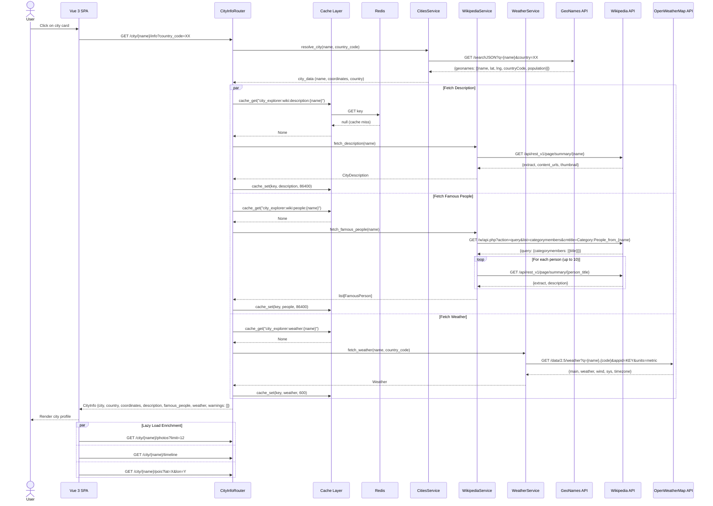
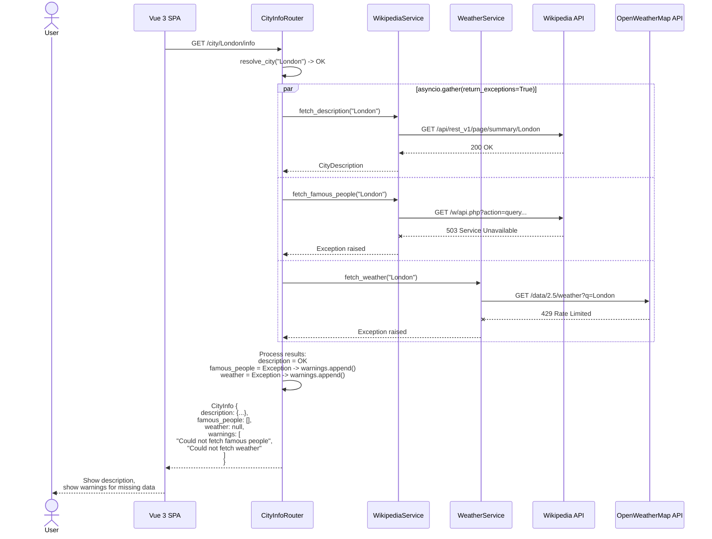
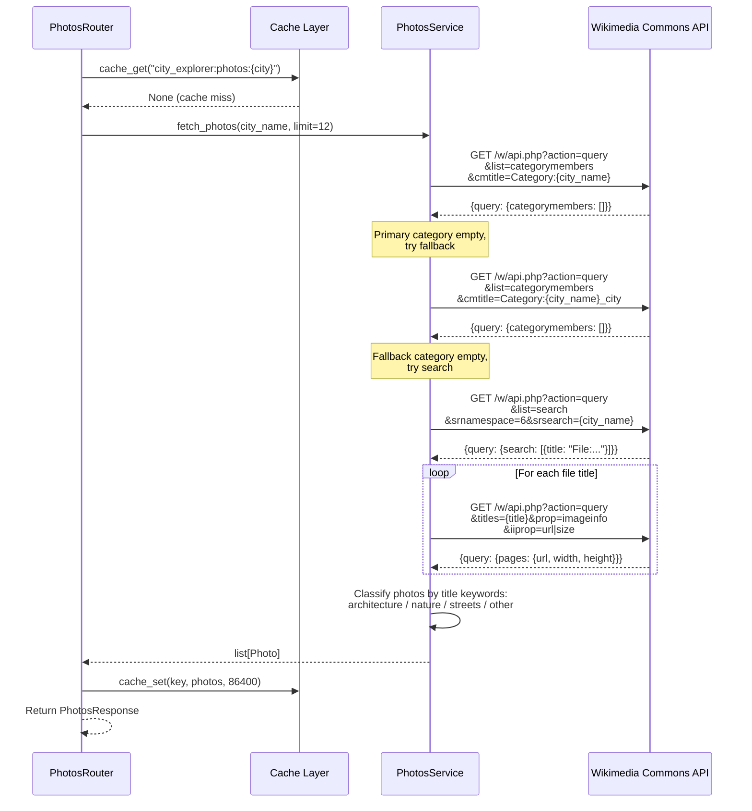
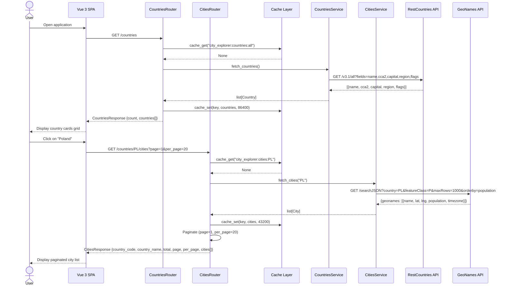

# Product Requirements Document — City Explorer API

**Version:** 1.0
**Date:** 2025-03-07
**Status:** Final

---

## Table of Contents

1. [Product Overview](#1-product-overview)
2. [Goals and Objectives](#2-goals-and-objectives)
3. [Functional Requirements](#3-functional-requirements)
4. [Non-Functional Requirements](#4-non-functional-requirements)
5. [System Architecture](#5-system-architecture)
   - 5.1 [Component Diagram](#51-component-diagram)
   - 5.2 [Class Diagram](#52-class-diagram)
   - 5.3 [Sequence Diagrams](#53-sequence-diagrams)
6. [API Endpoints Reference](#6-api-endpoints-reference)
7. [External API Integrations](#7-external-api-integrations)
8. [Data Models](#8-data-models)
9. [Error Handling Strategy](#9-error-handling-strategy)
10. [Glossary](#10-glossary)

---

## 1. Product Overview

City Explorer is a web application that aggregates city data from multiple external sources into a unified, user-friendly interface. It consists of a **FastAPI REST API** backend and a **Vue 3 Single Page Application** frontend. Users can browse countries, explore cities, and view rich city profiles including descriptions, weather, notable people, photo galleries, historical timelines, and points of interest.

### Key Value Propositions

- **Unified city data** from 6+ external APIs in a single interface
- **Graceful degradation** — partial upstream failures do not break the user experience
- **Lazy-loaded enrichment** — fast initial page load with progressive data loading
- **Caching layer** — Redis-backed caching reduces upstream API calls and improves response times

---

## 2. Goals and Objectives

| ID | Goal | Success Criteria |
|----|------|-----------------|
| G1 | Provide comprehensive city information from multiple data sources | Users can view description, weather, notable people, photos, timeline, and POIs for any city |
| G2 | Ensure fast and reliable user experience | P95 response time < 2s for cached requests; graceful degradation on upstream failures |
| G3 | Support city discovery workflows | Users can browse by country, compare cities, find nearby cities, and discover random cities |
| G4 | Maintain API stability and rate fairness | Rate limiting at 60 req/min per IP; consistent error response format |

---

## 3. Functional Requirements

### 3.1 Country Browsing

| ID | Requirement | Priority |
|----|-------------|----------|
| FR-01 | The system shall display a list of all countries with name, code, capital, region, and flag | Must |
| FR-02 | The system shall support case-insensitive search filtering of countries by name | Must |
| FR-03 | Country data shall be cached for 24 hours | Must |

### 3.2 City Browsing

| ID | Requirement | Priority |
|----|-------------|----------|
| FR-04 | The system shall display cities for a selected country with name, coordinates, population, and timezone | Must |
| FR-05 | City lists shall support server-side pagination (default 20, max 100 per page) | Must |
| FR-06 | The system shall support search filtering of cities by name | Must |
| FR-07 | City data shall be cached for 12 hours | Must |

### 3.3 City Profile — Core Information

| ID | Requirement | Priority |
|----|-------------|----------|
| FR-08 | The system shall display a city description sourced from Wikipedia | Must |
| FR-09 | The system shall display current weather data (temperature, humidity, wind, pressure, sunrise/sunset) | Must |
| FR-10 | The system shall display a list of notable people associated with the city (up to 10) with birth/death years and Wikipedia links | Must |
| FR-11 | The system shall aggregate description, weather, and notable people in a single request using parallel fetching | Must |
| FR-12 | If one or more upstream sources fail, the system shall return partial data with warnings instead of a full error | Must |
| FR-13 | An optional `country_code` parameter shall disambiguate cities with the same name | Should |

### 3.4 City Profile — Photo Gallery

| ID | Requirement | Priority |
|----|-------------|----------|
| FR-14 | The system shall display city photos sourced from Wikimedia Commons (default 12, max 50) | Must |
| FR-15 | Photos shall be classified into categories: architecture, nature, streets, other | Must |
| FR-16 | Users shall be able to filter photos by category | Must |
| FR-17 | The system shall use fallback strategies if the primary Wikimedia category yields no results (category variant, then search) | Should |

### 3.5 City Profile — Historical Timeline

| ID | Requirement | Priority |
|----|-------------|----------|
| FR-18 | The system shall display historical events for a city extracted from the Wikipedia History section | Must |
| FR-19 | Events shall include a year (100–2100) and description, sorted chronologically (max 50) | Must |
| FR-20 | Duplicate events shall be removed | Must |

### 3.6 City Profile — Points of Interest

| ID | Requirement | Priority |
|----|-------------|----------|
| FR-21 | The system shall display POIs within a 5 km radius of the city center, sourced from OpenStreetMap via the Overpass API | Must |
| FR-22 | POIs shall be categorized: museum, attraction, monument, park, religious, restaurant | Must |
| FR-23 | Users shall be able to filter POIs by category | Must |
| FR-24 | Each POI shall include name, category, coordinates, and distance from city center (Haversine) | Must |

### 3.7 Nearby Cities

| ID | Requirement | Priority |
|----|-------------|----------|
| FR-25 | The system shall display cities near a given city within a configurable radius (1–500 km, default 100 km) | Must |
| FR-26 | Results shall be sorted by distance and limited (1–50, default 10) | Must |

### 3.8 City Comparison

| ID | Requirement | Priority |
|----|-------------|----------|
| FR-27 | The system shall support side-by-side comparison of 2–5 cities | Must |
| FR-28 | Comparison data shall include population, timezone, country, weather, and notable people count | Must |

### 3.9 Random City Discovery

| ID | Requirement | Priority |
|----|-------------|----------|
| FR-29 | The system shall return a random city, optionally filtered by continent and population range | Must |

### 3.10 Frontend

| ID | Requirement | Priority |
|----|-------------|----------|
| FR-30 | The frontend shall provide three views: countries grid, cities list, and city profile | Must |
| FR-31 | The frontend shall lazy-load enrichment data (photos, timeline, POIs) after the main city info loads | Must |
| FR-32 | Each lazy-loaded section shall have independent loading spinners and error states with retry buttons | Must |
| FR-33 | The frontend shall provide breadcrumb navigation between views | Must |
| FR-34 | The frontend shall support keyboard navigation (Enter/Space on interactive cards) | Should |
| FR-35 | Search inputs shall be debounced (300 ms) | Should |

---

## 4. Non-Functional Requirements

### 4.1 Performance

| ID | Requirement | Target |
|----|-------------|--------|
| NFR-01 | Cached API response time | < 100 ms (P95) |
| NFR-02 | Uncached API response time (single upstream) | < 3 s (P95) |
| NFR-03 | City info aggregation response time | < 5 s (P95, 3 parallel upstream calls) |
| NFR-04 | HTTP client timeout | 10 seconds per upstream call |
| NFR-05 | Overpass API query timeout | 25 seconds |

### 4.2 Reliability & Availability

| ID | Requirement | Target |
|----|-------------|--------|
| NFR-06 | The system shall remain functional when Redis is unavailable | Cache returns None; services operate without caching |
| NFR-07 | The city info endpoint shall tolerate individual upstream API failures | Return partial data with warnings |
| NFR-08 | The system shall handle upstream API rate limits and errors gracefully | Log warning, return appropriate HTTP error |

### 4.3 Scalability

| ID | Requirement | Target |
|----|-------------|--------|
| NFR-09 | Rate limiting | 60 requests/minute per IP address |
| NFR-10 | Shared HTTP client | Single `httpx.AsyncClient` instance reused across all requests |
| NFR-11 | Connection pooling | Default httpx connection pool for upstream calls |

### 4.4 Security

| ID | Requirement | Target |
|----|-------------|--------|
| NFR-12 | API keys shall not be exposed to the frontend | Keys stored in environment variables, used server-side only |
| NFR-13 | Rate limiting shall prevent abuse | slowapi at 60/min per IP with 429 response |
| NFR-14 | Input validation on all endpoints | Pydantic models validate path/query parameters |

### 4.5 Maintainability

| ID | Requirement | Target |
|----|-------------|--------|
| NFR-15 | Structured logging | structlog with JSON output in production, pretty-print in development |
| NFR-16 | Configuration management | All settings via Pydantic BaseSettings, loaded from `.env` |
| NFR-17 | Test coverage | All endpoints tested with mocked external APIs (respx) |
| NFR-18 | Consistent error format | `{error: {code, message, detail}}` across all endpoints |

### 4.6 Caching

| ID | Requirement | TTL |
|----|-------------|-----|
| NFR-19 | Countries cache | 24 hours |
| NFR-20 | Cities cache | 12 hours |
| NFR-21 | Wikipedia content cache | 24 hours |
| NFR-22 | Weather cache | 10 minutes |
| NFR-23 | Photos cache | 24 hours |
| NFR-24 | POIs cache | 12 hours |

---

## 5. System Architecture

### 5.1 Component Diagram

```mermaid
graph TB
    subgraph "Client Layer"
        Browser["Web Browser"]
        VueApp["Vue 3 SPA<br/>(Options API, CDN)"]
    end

    subgraph "API Gateway Layer"
        FastAPI["FastAPI Application"]
        RateLimiter["Rate Limiter<br/>(slowapi, 60/min)"]
        StaticFiles["Static File Server"]
    end

    subgraph "Router Layer"
        CountriesRouter["/countries"]
        CitiesRouter["/countries/{code}/cities"]
        CityInfoRouter["/city/{name}/info"]
        PhotosRouter["/city/{name}/photos"]
        TimelineRouter["/city/{name}/timeline"]
        POIsRouter["/city/{name}/pois"]
        NearbyRouter["/city/{name}/nearby"]
        CompareRouter["/cities/compare"]
        RandomRouter["/city/random"]
    end

    subgraph "Service Layer"
        CountriesService["countries_service"]
        CitiesService["cities_service"]
        WikipediaService["wikipedia_service"]
        WeatherService["weather_service"]
        PhotosService["photos_service"]
        TimelineService["timeline_service"]
        POIService["poi_service"]
    end

    subgraph "Infrastructure Layer"
        Cache["Cache Layer<br/>(app/utils/cache.py)"]
        HttpClient["Shared HTTP Client<br/>(httpx.AsyncClient)"]
        Config["Settings<br/>(Pydantic BaseSettings)"]
    end

    subgraph "Data Layer"
        Redis[("Redis")]
    end

    subgraph "External APIs"
        RestCountries["RestCountries API"]
        GeoNames["GeoNames API"]
        Wikipedia["Wikipedia REST +<br/>Action API"]
        OpenWeatherMap["OpenWeatherMap API"]
        WikimediaCommons["Wikimedia Commons API"]
        OverpassAPI["Overpass API<br/>(OpenStreetMap)"]
    end

    Browser --> VueApp
    VueApp -->|"HTTP/JSON"| FastAPI
    FastAPI --> RateLimiter
    FastAPI --> StaticFiles
    StaticFiles --> VueApp

    FastAPI --> CountriesRouter
    FastAPI --> CitiesRouter
    FastAPI --> CityInfoRouter
    FastAPI --> PhotosRouter
    FastAPI --> TimelineRouter
    FastAPI --> POIsRouter
    FastAPI --> NearbyRouter
    FastAPI --> CompareRouter
    FastAPI --> RandomRouter

    CountriesRouter --> CountriesService
    CitiesRouter --> CitiesService
    CityInfoRouter --> WikipediaService
    CityInfoRouter --> WeatherService
    CityInfoRouter --> CitiesService
    PhotosRouter --> PhotosService
    TimelineRouter --> TimelineService
    POIsRouter --> POIService
    NearbyRouter --> CitiesService
    CompareRouter --> CitiesService
    CompareRouter --> WeatherService
    CompareRouter --> WikipediaService
    RandomRouter --> CitiesService

    CountriesService --> HttpClient
    CitiesService --> HttpClient
    WikipediaService --> HttpClient
    WeatherService --> HttpClient
    PhotosService --> HttpClient
    TimelineService --> HttpClient
    POIService --> HttpClient

    CountriesRouter --> Cache
    CitiesRouter --> Cache
    CityInfoRouter --> Cache
    PhotosRouter --> Cache
    TimelineRouter --> Cache
    POIsRouter --> Cache
    NearbyRouter --> Cache
    RandomRouter --> Cache

    Cache --> Redis

    HttpClient --> RestCountries
    HttpClient --> GeoNames
    HttpClient --> Wikipedia
    HttpClient --> OpenWeatherMap
    HttpClient --> WikimediaCommons
    HttpClient --> OverpassAPI
```



### 5.2 Class Diagram

```mermaid
classDiagram
    direction LR

    class Settings {
        +str app_env
        +int app_port
        +str log_level
        +str redis_url
        +str openweathermap_api_key
        +str geonames_username
        +int cache_ttl_countries
        +int cache_ttl_cities
        +int cache_ttl_wiki
        +int cache_ttl_weather
        +int cache_ttl_photos
        +int cache_ttl_pois
        +bool is_production
    }

    class Country {
        +str name
        +str code
        +str capital
        +str region
        +str flag_url
    }

    class CountriesResponse {
        +int count
        +list~Country~ countries
    }

    class City {
        +str name
        +float latitude
        +float longitude
        +int population
        +str timezone
    }

    class CitiesResponse {
        +str country_code
        +str country_name
        +int total
        +int page
        +int per_page
        +list~City~ cities
    }

    class CityDescription {
        +str summary
        +str url
        +str thumbnail_url
        +str wikipedia_title
    }

    class FamousPerson {
        +str name
        +str description
        +str url
        +int birth_year
        +int death_year
    }

    class Weather {
        +str condition
        +str icon
        +float temperature
        +float feels_like
        +int humidity
        +float wind_speed
        +str wind_direction
        +int pressure
        +int visibility
        +int clouds
        +str sunrise
        +str sunset
    }

    class CityInfo {
        +str city
        +str country
        +str country_code
        +Coordinates coordinates
        +CityDescription description
        +list~FamousPerson~ famous_people
        +Weather weather
        +list~str~ data_sources
        +list~str~ warnings
    }

    class Photo {
        +str title
        +str url
        +str thumbnail_url
        +int width
        +int height
        +str category
    }

    class PhotosResponse {
        +str city
        +list~Photo~ photos
        +int total
    }

    class HistoricalEvent {
        +int year
        +str event
    }

    class TimelineResponse {
        +str city
        +list~HistoricalEvent~ events
        +int total
    }

    class PointOfInterest {
        +str name
        +str category
        +float latitude
        +float longitude
        +float distance_km
        +dict tags
    }

    class POIResponse {
        +str city
        +list~PointOfInterest~ pois
        +int total
    }

    class Coordinates {
        +float lat
        +float lon
    }

    class NearbyCityEntry {
        +str name
        +str country
        +str country_code
        +float latitude
        +float longitude
        +int population
        +float distance_km
    }

    class NearbyCitiesResponse {
        +str origin_city
        +str origin_country
        +Coordinates origin_coordinates
        +int radius_km
        +list~NearbyCityEntry~ nearby_cities
        +int total
    }

    class CityComparisonEntry {
        +str city
        +str country
        +str country_code
        +int population
        +str timezone
        +Weather weather
        +int famous_people_count
    }

    class CityComparisonResponse {
        +list~CityComparisonEntry~ cities
        +list~str~ data_sources
    }

    class RandomCityResponse {
        +str city
        +str country
        +str country_code
        +Coordinates coordinates
        +int population
        +str timezone
        +list~str~ data_sources
    }

    class CountriesService {
        +fetch_countries(client) list~Country~
    }

    class CitiesService {
        +fetch_cities(client, country_code) list~City~
        +resolve_city(client, city_name, country_code) dict
        +find_nearby(client, lat, lon, radius, limit) list~dict~
    }

    class WikipediaService {
        +fetch_description(client, city_name) CityDescription
        +fetch_famous_people(client, city_name) list~FamousPerson~
    }

    class WeatherService {
        +fetch_weather(client, city, country_code) Weather
    }

    class PhotosService {
        +fetch_photos(client, city_name, limit) list~Photo~
    }

    class TimelineService {
        +fetch_timeline(client, city_name) list~HistoricalEvent~
    }

    class POIService {
        +fetch_pois(client, lat, lon, radius) list~PointOfInterest~
    }

    class CacheLayer {
        +cache_get(key) any
        +cache_set(key, value, ttl) None
        +cached(ttl, key_builder) decorator
    }

    class SharedHttpClient {
        +httpx.AsyncClient client
        +create_http_client() None
        +close_http_client() None
    }

    CountriesResponse *-- Country
    CitiesResponse *-- City
    CityInfo *-- CityDescription
    CityInfo *-- FamousPerson
    CityInfo *-- Weather
    CityInfo *-- Coordinates
    PhotosResponse *-- Photo
    TimelineResponse *-- HistoricalEvent
    POIResponse *-- PointOfInterest
    NearbyCitiesResponse *-- NearbyCityEntry
    NearbyCitiesResponse *-- Coordinates
    CityComparisonResponse *-- CityComparisonEntry
    CityComparisonEntry *-- Weather
    RandomCityResponse *-- Coordinates

    CountriesService --> SharedHttpClient : uses
    CitiesService --> SharedHttpClient : uses
    WikipediaService --> SharedHttpClient : uses
    WeatherService --> SharedHttpClient : uses
    PhotosService --> SharedHttpClient : uses
    TimelineService --> SharedHttpClient : uses
    POIService --> SharedHttpClient : uses

    CountriesService --> CacheLayer : uses
    CitiesService --> CacheLayer : uses
    WikipediaService --> CacheLayer : uses
    WeatherService --> CacheLayer : uses
    PhotosService --> CacheLayer : uses
    TimelineService --> CacheLayer : uses
    POIService --> CacheLayer : uses
```



### 5.3 Sequence Diagrams

#### 5.3.1 City Info Aggregation (Main Flow)



#### 5.3.2 City Info — Partial Failure



#### 5.3.3 Photo Gallery with Fallback Strategy



#### 5.3.4 Country and City Browsing



#### 5.3.5 Points of Interest Flow

```mermaid
sequenceDiagram
    participant Frontend as Vue 3 SPA
    participant Router as POIsRouter
    participant Cache as Cache Layer
    participant Svc as POIService
    participant Overpass as Overpass API

    Frontend->>Router: GET /city/Warsaw/pois?lat=52.2297&lon=21.0122&category=all

    Router->>Cache: cache_get("city_explorer:pois:52.2297:21.0122")
    Cache-->>Router: None

    Router->>Svc: fetch_pois(52.2297, 21.0122, radius=5000)

    Svc->>Overpass: POST /api/interpreter<br/>data=[out:json][timeout:25];<br/>(node["tourism"~"museum|attraction|viewpoint"]<br/>(around:5000,52.2297,21.0122);<br/>node["historic"~"monument|memorial|castle"]...;<br/>node["leisure"="park"]...;<br/>node["amenity"~"place_of_worship|restaurant"]...);<br/>out center 100;
    Overpass-->>Svc: {elements: [{type, lat, lon, tags}]}

    loop For each element
        Svc->>Svc: Extract coordinates (node: lat/lon, way: center)
        Svc->>Svc: Calculate Haversine distance
        Svc->>Svc: Classify category by OSM tags
    end

    Svc->>Svc: Sort by distance, limit 50
    Svc-->>Router: list[PointOfInterest]

    Router->>Cache: cache_set(key, pois, 43200)
    Router-->>Frontend: POIResponse {city, pois[], total}
```

---

## 6. API Endpoints Reference

| Method | Endpoint | Description | Query Parameters | Cache TTL |
|--------|----------|-------------|-----------------|-----------|
| GET | `/countries` | List all countries | `search` (optional) | 24h |
| GET | `/countries/{country_code}/cities` | List cities in a country | `search`, `page`, `per_page` | 12h |
| GET | `/city/{city_name}/info` | Aggregated city information | `country_code` (optional) | varies |
| GET | `/city/{city_name}/photos` | City photo gallery | `limit` (1–50), `category` | 24h |
| GET | `/city/{city_name}/timeline` | Historical timeline | — | 24h |
| GET | `/city/{city_name}/pois` | Points of interest | `lat`, `lon` (required), `category` | 12h |
| GET | `/city/{city_name}/nearby` | Nearby cities | `radius_km` (1–500), `limit` (1–50) | 12h |
| GET | `/cities/compare` | Compare multiple cities | `cities` (comma-separated, 2–5) | — |
| GET | `/city/random` | Random city | `region`, `min_population`, `max_population` | 12h |
| GET | `/health` | Health check | — | — |

---

## 7. External API Integrations

| Service | Base URL | Authentication | Used By |
|---------|----------|---------------|---------|
| RestCountries | `https://restcountries.com/v3.1` | None | CountriesService |
| GeoNames | `http://api.geonames.org` | `GEONAMES_USERNAME` (query param) | CitiesService |
| OpenWeatherMap | `https://api.openweathermap.org/data/2.5` | `OPENWEATHERMAP_API_KEY` (query param) | WeatherService |
| Wikipedia REST | `https://en.wikipedia.org/api/rest_v1` | None | WikipediaService |
| Wikipedia Action | `https://en.wikipedia.org/w/api.php` | None | WikipediaService, TimelineService |
| Wikimedia Commons | `https://commons.wikimedia.org/w/api.php` | None | PhotosService |
| Overpass (OSM) | `https://overpass-api.de/api/interpreter` | None | POIService |

---

## 8. Data Models

### Response Envelope Patterns

**Success responses** return domain-specific Pydantic models serialized as JSON.

**Error responses** follow a consistent format:

```json
{
  "error": {
    "code": "ERROR_CODE",
    "message": "Human-readable message",
    "detail": "Additional context"
  }
}
```

### Standard Error Codes

| Code | HTTP Status | Description |
|------|------------|-------------|
| `NOT_FOUND` | 404 | Requested resource not found |
| `VALIDATION_ERROR` | 422 | Invalid request parameters |
| `RATE_LIMITED` | 429 | Too many requests |
| `UPSTREAM_ERROR` | 503 | External API unavailable |

---

## 9. Error Handling Strategy

### 9.1 Upstream API Failures

| Scenario | Behavior |
|----------|----------|
| Single upstream fails in city info | Return partial data with warning |
| All upstreams fail in city info | Return 503 |
| GeoNames unavailable | Return 503 (city resolution is required) |
| Redis unavailable | Cache functions return None; services operate normally |
| Upstream returns invalid data | Log error, treat as failure |

### 9.2 Fallback Strategies

| Service | Primary | Fallback 1 | Fallback 2 |
|---------|---------|-----------|-----------|
| Wikipedia description | `/page/summary/{city}` | `/page/summary/{city}_(city)` | — |
| Wikimedia photos | `Category:{city}` | `Category:{city}_city` | Search in File namespace |

### 9.3 Rate Limiting

- **Internal:** 60 requests/minute per IP via slowapi
- **External:** Handled by catching 429 responses from upstream APIs and returning appropriate errors

---

## 10. Glossary

| Term | Definition |
|------|-----------|
| **Enrichment data** | Secondary data (photos, timeline, POIs) loaded lazily after the main city info |
| **Partial failure** | Scenario where some upstream APIs fail but the response is still returned with available data |
| **Haversine distance** | Formula for calculating great-circle distance between two geographic coordinates |
| **Overpass QL** | Query language for the Overpass API to retrieve OpenStreetMap data |
| **Cache miss** | When requested data is not found in Redis, requiring a fresh upstream API call |
| **TTL** | Time To Live — duration before cached data expires |
| **POI** | Point of Interest — a notable location (museum, monument, park, etc.) |
| **SPA** | Single Page Application — the Vue 3 frontend loaded as a single HTML page |
